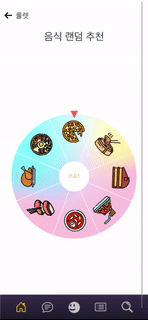

# BOBfull

> 익명 기반 식사 매칭 [BoBfull] project
> 
> 여기에 로고 작은거 넣기
>
> [Backdend-Domain](https://bobfullbean-env.eba-mxtkhmg5.ap-northeast-2.elasticbeanstalk.com/) 
>
> [Frontend-Domain](https://master.d3n2xysrd0lvj9.amplifyapp.com/main)
>
> [Frontend-Repository](https://github.com/Yoonsik-Shin/bobfull_react/)

## 🔖 Table of contents

- [BOBfull](#BOBfull)
  - [🔖 Table of contents](#-table-of-contents)
  - [📜 General info](#-general-info)
  - [🧭Preview](#Preview)
  - [🗃️Modeling](#️modeling)
    - [ERD모델](#erd-모델)
    - [와이어프레임](#와이어-프레임)
  - [💻Technologies](#technologies)
    - [Technology stack](#technology-stack)
  - [🔍Features](#features)
    - [Backend](#Backend)
      - [Accounts APP](#accounts-app)
      - [Articles APP](#articles-app)
      - [Community APP](#community-app)
      - [Multichat APP](#multichat-app)
      - [Restaurant APP](#restaurant-app)
    - [Frontend](#Frontend)
        - [???](#???)
        - [????](#????)
  - [💬Reviews](#reviews)
  - [Scrum Records](#scrum-records)

## 📜 General info

- 개발기간 : 2022. 11. 23 - 2022. 12. 14

- 팀원
  
  - Front-end([신윤식](https://github.com/Yoonsik-Shin/), [이용환](https://github.com/tnpfldyd/))
  - Back-end([김문경](https://github.com/kmk4162/), [이주용](https://github.com/yaonggod/), [이태극](https://github.com/uRo3YA/))

## 🧭Preview

- 메인 화면
	- 
- 프로필 페이지
  - 

- 룰렛
  - 

- 리뷰 작성
  - 

## 🗃️Modeling

### ERD 모델

> .png)

### 와이어 프레임

> 

## 💻Technologies

### Technology stack

- Version Control and Messenger
  
    

  
  
- Backend 
  
   

  
  
- Frontend
  
     
* Infra
  
     
  
  
  
* CI/CD

  

## 🔍Features

### Backend

#### Accounts APP

- 계정 생성 및 로그인
  - JWT인증 방식을 이용한 토큰 기반 로그인 구현
- 구글, 카카오 소셜 로그인

- 추가 설정을 통한 개인정보 수정 기능
-  유저의 활동 내역 조회

#### Articles APP

-  식당별 리뷰
    - 식당 PK을 기준으로 짧은 리뷰 생성
    - 별점 기능
-  매칭룸 생성 기능
    - 약속시간 생성
-  매칭룸 참가 기능
    - POST 요청으로 접속한 계정을 매칭룸 멤버에 추가
-  매칭 후기
    - 각 멤버 별로 매칭에 참가 한 이후 타인 유저를 평가
    - 평가 점수에 따라 해당 유저의 매너 온도 변화

#### Community APP

-  
- 

#### Multichat APP

- 유저가 참여하고 있는 채팅방 리스트 
- 매칭룸별 채팅방 생성
- 채팅방에 있는 모든 메세지 보기
- 채팅방에 메세지 전송하기
- 기존에 존재하는 채팅방에 참여하기
- 채팅방 나가기
- 식사 후 채팅방 없애기

#### Restaurant APP

- 카카오맵을 통한 음식점 데이터 크롤링(강남, 판교)
- 음식점 북마크 기능

### Frontend

#### ???

- ????????

#### ????

- ???????????

## 💬Reviews

- 김문경
  
  - 
  - 
  - 
  
- 신윤식
  
  - 
  - 
  - 

- 이용환
  
  - 
  - 
  - 

- 이주용
  
  - 
  - 
  - 
  - 

- 이태극
  
  - 
  - 
  - 
  

## Scrum Records

- 스크럼 일지
  
  
